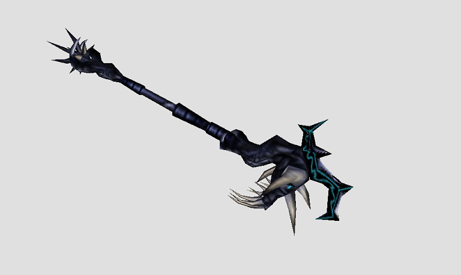

# webgl-jsonloader

> Three.js model loader for 3d object (**.obj**) files.

### Requirements

This project has no dependencies since it only contains static website files. Other local web servers that allow the hosting of static files are alternate options for local host development.

1. Three.js
	- version r114
	- _(already included in the scripts folders)_
2. (Optional) Docker
   - Required to run a Dockerized Node web server for local development

### Demo

[https://muonlineph.github.io/webgl-jsonloader/](https://muonlineph.github.io/webgl-jsonloader/)

## Installation

1. Clone this repository. 
`https://github.com/muonlineph/webgl-jsonloader.git`

2. Pull the local web server image (this requires Docker installed). 
`docker pull weaponsforge/livereload-basic:latest`

3. Run the local web server. Navigate to the project root directory using a terminal, then run the local web server. 
`docker run -it --rm -p 3000:3000 -v %cd%\public:/opt/app/public -e IS_DOCKER=true -e USE_POLLING=true weaponsforge/livereload-basic:latest`

4. Load the webgl json loader from 
`http://localhost:3000`

5. Load the basic-usage object loader demo from 
`http://localhost:3000/simple.html`

6. Edit the existing static files from the **./public** directory and wait for live reload. Your updates will reflect on the web browser.

## Usage

### Model Viewer and Object Loader Usage

> This is the recommended usage for rendering object models as all Three.js scenes are already set-up in the **Viewer** object.

1. Include the required Three.js files in your website (from the **/public/js** directory): 
`three.min.js`, `DDSLoader.js`, `MTLLoader.js`, `TGALoader.js`, `OBJLoader.js`.

2. Include the custom loader and model viewer (from the **/public** directory): 
`loader.js`, `viewer.js`

3. Load your object model(s) using **async-await**, but do not add them to the **scene**. See [**Object Loader (Basic Usage)**, #4]() for more usage information.

		let a = await loadModel(...)
		let b = await loadModel(...)
		let c = await loadModel(...)

4. Initialize a new **Viewer** object with the loaded models from #1 as parameters. 
`const viewer = new Viewer([a, b, c])`

### Object Loader (Basic Usage)

1. Include the required Three.js files in your website (from the **/public/js** directory): 
`three.min.js`, `DDSLoader.js`, `MTLLoader.js`, `OBJLoader.js`.

2. Include the custom loader and model viewer (from the **/public** directory): 
`loader.js`, `simple.js`

3. Initialize a ThreeJS scene, camera and renderer. See `public/simple.js` **init()** for more information.

4. Load ojbect model file(s) (.obj) and add to the ThreeJS scene with optional values for `position`, `rotation` and `scale`.

		let staff = await loadModel('objects/staffofkundun/', 'kundun-OBJ.mtl', 'kundun-OBJ.obj', {
		  position: { y:10 },
		  rotation: { x:-Math.PI/2, y:-Math.PI/3*2, z:-Math.PI/2 },
			scale: { x:2, y:2, z:2 }
		})

		scene.add(staff)

	- see `public/loader.js` for more object loading options
	- any number of object files can be loaded and added to the `scene`.

@weaponsforge 
20200320 
20241006
